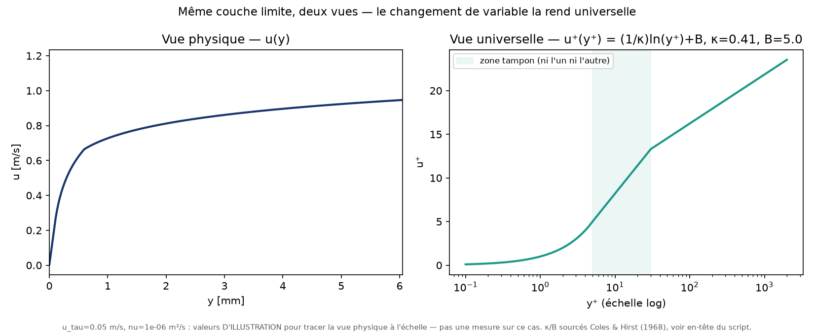
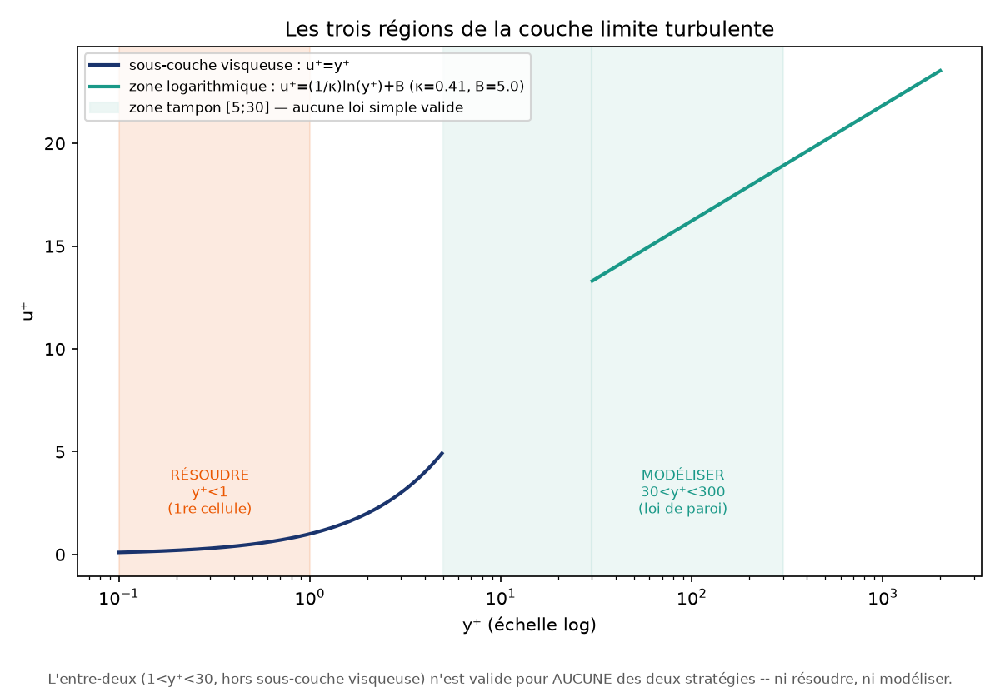
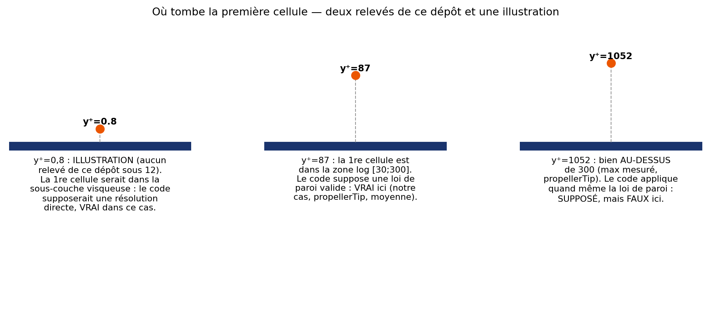
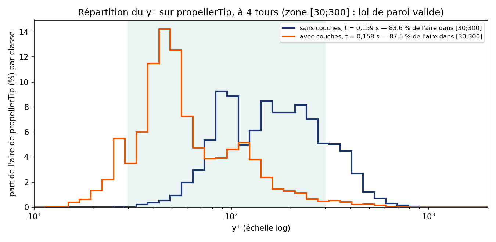
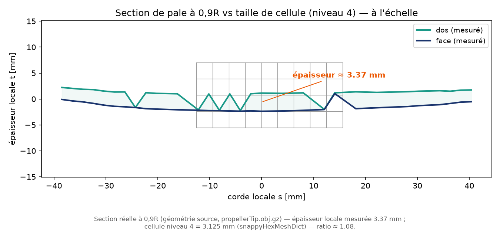

# Base théorique — Hélice en eau libre et fermetures de turbulence

## 1. Performance hélice en eau libre

Une hélice en eau libre (open water) est caractérisée sans interaction carène par 3 grandeurs
adimensionnées, fonctions du coefficient d'avance $J$ :

$$J = \frac{V_a}{nD}$$

avec $V_a$ la vitesse d'avance, $n$ la vitesse de rotation (tr/s), $D$ le diamètre de l'hélice.

$$K_T = \frac{T}{\rho n^2 D^4} \qquad K_Q = \frac{Q}{\rho n^2 D^5} \qquad \eta_0 = \frac{K_T}{K_Q}\cdot\frac{J}{2\pi}$$

où $T$ est la poussée (thrust), $Q$ le couple (torque), $\rho$ la masse volumique du fluide,
$\eta_0$ le rendement en eau libre. Ce sont les 3 sorties comparées entre modèles de turbulence
dans ce TD (colonnes `KT`, `10*KQ`, `eta0` de `postProcessing/propellerInfo1/*/propellerPerformance.dat`,
écrites directement par le function object `propellerInfo` du tutoriel — $K_Q$ y est tabulé
multiplié par 10 par convention d'affichage, à diviser par 10 pour la valeur physique).

## 2. Pourquoi le modèle de turbulence change le résultat

Les équations de Navier-Stokes exactes (DNS) sont hors de portée en TD (coût de calcul). Les
solveurs RANS (Reynolds-Averaged Navier-Stokes, ici `pimpleFoam`) résolvent un écoulement moyenné
et modélisent l'effet des fluctuations turbulentes via un tenseur de Reynolds fermé par un
**modèle de fermeture** — d'où l'attendu référentiel « se familiariser à la différence des
résultats selon le modèle de turbulence » : le modèle n'est pas un détail numérique, c'est une
hypothèse physique sur la turbulence qui change directement la traînée et donc $K_Q$/$\eta_0$.
Ce qui suit déroule cette phrase pas à pas : d'où viennent les équations qu'on résout réellement,
ce que change la moyenne, pourquoi le système d'équations n'est alors plus résoluble tel quel, et
ce que chaque modèle AJOUTE pour le refermer.

### Navier-Stokes incompressible, et pourquoi on ne les résout pas telles quelles ici

L'écoulement autour de la pale obéit, en tout point et à tout instant, à deux équations : la
conservation de la masse (incompressible, $\rho$ constant) et la conservation de la quantité de
mouvement.

$$\nabla \cdot \vec{u} = 0 \qquad\qquad \frac{\partial \vec{u}}{\partial t} + (\vec{u}\cdot\nabla)\vec{u} = -\frac{1}{\rho}\nabla p + \nu \nabla^2 \vec{u}$$

$\vec{u}=(u_x,u_y,u_z)$ est la vitesse INSTANTANÉE (pas une moyenne — la vraie vitesse, qui
fluctue à toutes les échelles dans un écoulement turbulent), $p$ la pression, $\nu$ la viscosité
cinématique (`constant/transportProperties`, 1e-6 m²/s, PARAMETRES_CAS.md). En 3D, ce sont
**4 équations** (une conservation de la masse, trois composantes
de quantité de mouvement) pour **4 inconnues** ($u_x$, $u_y$, $u_z$, $p$) : le système est
FERMÉ — autant d'équations que d'inconnues, résoluble en principe.

« En principe » : les résoudre DIRECTEMENT (DNS, Direct Numerical Simulation) demande de mailler
TOUTES les échelles de la turbulence, de la plus grande (la taille du sillage) à la plus petite
(où la viscosité dissipe l'énergie en chaleur) — un nombre de mailles qui explose avec le nombre
de Reynolds de l'écoulement. Hors de portée du budget de calcul de ce TD (et de l'immense
majorité des calculs industriels) : voir `Helice/docs/PARAMETRES_CAS.md` (coût mesuré par pas et
par tour sur ce cas) pour ce que ce budget permet réellement ici.

### La décomposition de Reynolds

L'idée (Reynolds, 1895) : puisqu'on ne peut pas suivre la vitesse instantanée partout, on la
décompose en une moyenne temporelle $\bar{u}$ (ce qui nous intéresse — le débit, la poussée
moyenne) et une fluctuation $u'$ autour de cette moyenne (ce qu'on renonce à suivre en détail) :

$$u_x = \bar{u}_x + u_x' \qquad u_y = \bar{u}_y + u_y' \qquad u_z = \bar{u}_z + u_z' \qquad p = \bar{p} + p'$$

avec, par construction de la moyenne, $\overline{u_x'} = \overline{u_y'} = \overline{u_z'} = 0$ —
la fluctuation s'annule EN MOYENNE, mais pas son carré ni ses produits croisés, qui restent non
nuls et transportent de l'énergie (la demi-somme des trois carrés, $\tfrac12\overline{u_i'u_i'}$,
EST l'énergie cinétique turbulente $k$ — introduite plus loin, § « k-epsilon » ; les produits
croisés, eux, alimentent le tenseur de Reynolds ci-dessous, pas $k$ directement). On substitue
cette décomposition dans les deux équations ci-dessus et on moyenne à nouveau tout le système.

### Le problème de fermeture — le point central

Moyenner les équations sur $\bar{u}_x$, $\bar{u}_y$, $\bar{u}_z$, $\bar{p}$ ne fait pas
disparaître les fluctuations : le terme non linéaire $(\vec{u}\cdot\nabla)\vec{u}$, une fois
moyenné, fait apparaître un terme NOUVEAU qui ne s'annule pas — la moyenne du PRODUIT de deux
fluctuations, $\overline{u_i' u_j'}$. Le **tenseur de Reynolds** (ou « contrainte de Reynolds »)
est, à un facteur $-\rho$ près, exactement ce produit : $\tau_{ij}^{\,turb} = -\rho\,
\overline{u_i' u_j'}$ — le signe et le $\rho$ n'en changent pas le compte d'inconnues (toujours
6 composantes indépendantes, ci-dessous), seulement l'unité physique (une contrainte, pas une
vitesse au carré). Physiquement, c'est un transport de quantité de mouvement PAR la turbulence
elle-même, qui agit sur l'écoulement moyen exactement comme une contrainte supplémentaire (une
viscosité additionnelle, mais qui dépend de l'écoulement et n'est pas une propriété du fluide).

**Ce terme est le problème.** Il est symétrique (3×3, donc 6 composantes indépendantes :
$\overline{u_x'^2}$, $\overline{u_y'^2}$, $\overline{u_z'^2}$, $\overline{u_x'u_y'}$,
$\overline{u_x'u_z'}$, $\overline{u_y'u_z'}$) et il n'est PAS exprimable avec les seules
inconnues moyennes $\bar{u}_x$, $\bar{u}_y$, $\bar{u}_z$, $\bar{p}$ — c'est une inconnue
SUPPLÉMENTAIRE, à 6 composantes, que les équations moyennées elles-mêmes ne permettent pas de
calculer. Comptons : le système moyenné porte toujours 4 équations (masse + 3 quantité de
mouvement, moyennées), mais désormais $4 + 6 = 10$ inconnues ($\bar{u}_x$, $\bar{u}_y$, $\bar{u}_z$,
$\bar{p}$, plus les 6 composantes du tenseur de Reynolds). **4 équations, 10 inconnues : le
système n'est plus fermé.** C'est CELA, le problème de fermeture (« closure problem ») — pas une
difficulté numérique, un déficit d'équations, comptable. Tout modèle de turbulence RAS
(k-epsilon, k-omega SST, et toute autre fermeture) est une manière de FOURNIR les 6 équations
manquantes — jamais les équations exactes du tenseur de Reynolds (qui, en toute rigueur, en
ferait apparaître d'autres, encore inconnues, à l'infini), mais une HYPOTHÈSE physique qui
approche son effet avec un nombre gérable de nouvelles inconnues et d'équations de transport
pour les fermer.

*Références pour les trois sous-sections ci-dessus : Çengel & Cimbala, Fluid Mechanics — Fundamentals and
Applications (décomposition de Reynolds, équations moyennées) ; Wilcox, D.C., Turbulence Modeling
for CFD (hypothèse de Boussinesq, fermetures $k$-$\varepsilon$/$k$-$\omega$) ; Menter, F.R. (1994),
"Two-Equation Eddy-Viscosity Turbulence Models for Engineering Applications", AIAA Journal 32(8)
(fonction de mélange du modèle SST).*

### La première fermeture historique : la longueur de mélange de Prandtl

Le problème de fermeture est plus ancien que la CFD, et la première réponse tient en quelques lignes.
Boussinesq propose, par analogie avec la viscosité moléculaire, de traiter l'effet des fluctuations
comme une viscosité supplémentaire. Dans le cas le plus simple — écoulement moyen parallèle à $x$, ne
dépendant que de la distance $y$ à la paroi — la contrainte de cisaillement turbulente s'écrit

$$\tau_{turb} = -\rho\,\overline{u_x' u_y'} = \rho\,\nu_t\,\frac{d\bar{u}_x}{dy}$$

$\nu_t$, la **viscosité turbulente**, n'est pas une propriété du fluide : elle décrit l'écoulement, et
elle est à ce stade inconnue. Il reste à la relier à l'écoulement moyen. C'est ce que fait Prandtl,
par un raisonnement de particule fluide :

1. Une particule qui quitte une couche pour traverser $y$ sur une distance $\ell$ arrive dans un
   environnement dont la vitesse moyenne diffère de sa vitesse d'origine d'environ
   $\Delta u \approx \ell\,\dfrac{d\bar{u}_x}{dy}$ (développement de Taylor au premier ordre). Cet écart
   est de l'ordre de la fluctuation $u_x'$ ; Prandtl **postule** que la fluctuation transverse $u_y'$ est
   du même ordre.
2. Les deux fluctuations sont **anticorrélées** — la continuité en fixe le signe : quand la particule monte
   ($u_y' > 0$), elle vient d'une couche plus lente ($u_x' < 0$), et inversement. Le produit moyen est donc négatif et de module
   $\ell^2 (d\bar{u}_x/dy)^2$, à une constante près que l'on absorbe dans $\ell$.
3. D'où la contrainte et la viscosité turbulentes :

$$\tau_{turb} = \rho\,\ell^2\left(\frac{d\bar{u}_x}{dy}\right)^2 \qquad\qquad \nu_t = \ell^2\left|\frac{d\bar{u}_x}{dy}\right|$$

$\ell$ est la **longueur de mélange** : la distance sur laquelle une particule conserve son identité
avant de se fondre dans son voisinage. Cela ne ferme rien tant qu'on ne dit pas ce qu'est $\ell$ ;
près d'une paroi, l'hypothèse de Prandtl est qu'elle croît linéairement avec la distance à celle-ci,
$\ell = \kappa\,y$, où $\kappa \approx 0{,}4$ est la **constante de von Kármán**. Le tenseur de Reynolds
est alors exprimé par une seule fonction prescrite, sans aucune équation de transport
supplémentaire.

> **FIG:TD-HELICE-001 à insérer** (rognage manuel enseignant, voir Amiroudine & Battaglia, Fig. 8.7,
> p.203). Légende prévue : « Hypothèse de la longueur de mélange de Prandtl : une particule déplacée
> de $\ell$ transporte la vitesse de sa couche d'origine ; l'écart avec le voisinage donne la
> fluctuation. » Source PDF : pas de capture automatique.

*Source : Amiroudine & Battaglia, chap. 8, §8.7 (éq. 8.34 à 8.42, et $\ell = \kappa y$ en fin de section), reformulé ; les équations sont
des relations mathématiques, la formulation est de ce document.*

**Paragraphe de transition — texte standard de cours de turbulence, NON sourcé dans cette
section (à ne pas lire comme une reformulation d'Amiroudine & Battaglia).** La longueur de mélange
prescrit $\ell$ par une formule algébrique en $y$ : elle n'a ni transport ni mémoire, et n'a de sens
que dans une couche de cisaillement mince le long d'une paroi. $k$-$\varepsilon$ et $k$-$\omega$ SST,
utilisés dans les cas OpenFOAM de ce TD, sont les généralisations modernes de ce principe : ils gardent
l'idée d'une viscosité turbulente $\nu_t$ (hypothèse de Boussinesq), mais au lieu de prescrire $\ell$,
ils **transportent** deux grandeurs turbulentes ($k$ et $\varepsilon$, ou $k$ et $\omega$) dont on
déduit $\nu_t$. L'échelle de longueur de la turbulence, de l'ordre de $k^{3/2}/\varepsilon$, devient
alors un résultat du calcul, pas une donnée d'entrée. Ce que la longueur de mélange a établi près de la
paroi — le profil logarithmique, §4 — n'a pas disparu : c'est ce que ces modèles doivent retrouver, et
ce que la loi de paroi leur impose quand on ne résout pas la sous-couche.

### k-epsilon (RAS, `case_kEpsilon`)

**Ce qu'il postule** : l'hypothèse de Boussinesq — le tenseur de Reynolds (6 composantes
inconnues, § précédente) est supposé PROPORTIONNEL au taux de déformation de l'écoulement moyen
via un coefficient scalaire $\nu_t$ (la « viscosité turbulente », qui n'est pas une propriété du
fluide mais de l'écoulement lui-même), plus un terme isotrope en $k$ nécessaire pour que la trace
du tenseur reste correcte (la trace du taux de déformation est nulle en incompressible, alors
que celle du tenseur de Reynolds vaut $2k$, jamais nulle). Cette hypothèse ramène les 6 inconnues
à DEUX, $\nu_t$ et $k$ — un progrès énorme (6 à 2), au prix d'une approximation qui n'est pas
toujours vraie (le tenseur réel n'est pas toujours aligné avec le taux de déformation moyen).

**Ce qu'il ferme** : deux équations de transport supplémentaires, une pour l'énergie cinétique
turbulente $k$ et une pour son taux de dissipation $\varepsilon$, dont $\nu_t$ se déduit
($\nu_t = C_\mu k^2/\varepsilon$). Le système redevient fermé : 4 équations moyennées + 2
équations de transport = 6 équations, pour $\bar{u}_x$, $\bar{u}_y$, $\bar{u}_z$, $\bar{p}$, $k$,
$\varepsilon$ = 6 inconnues.

Robuste et peu coûteux en zone de cisaillement libre (sillage loin de la paroi), mais connu pour
sur-estimer la turbulence en proche paroi et en gradient de pression adverse — précisément la
situation sur l'extrados/l'intrados d'une pale où l'écoulement peut décoller localement.

### k-omega SST (RAS, `case_kOmegaSST`)

**Ce qu'il postule** : la MÊME hypothèse de Boussinesq que k-epsilon (un $\nu_t$ scalaire) — la
différence n'est pas dans le principe de fermeture, mais dans les DEUX équations de transport
choisies pour l'obtenir.

**Ce qu'il ferme, et pourquoi il bascule entre deux formulations** : $k$-$\omega$ (transport de
$k$ et du taux de dissipation spécifique $\omega$) se comporte mieux que $k$-$\varepsilon$ tout
contre la paroi (pas besoin d'une fonction de paroi aussi contraignante, plus robuste en
sous-couche visqueuse), mais devient sensible et moins fiable loin de la paroi, en écoulement
libre — exactement l'inverse de $k$-$\varepsilon$, robuste loin de la paroi mais imprécis tout
contre elle. Le modèle SST (« Shear Stress Transport ») ne choisit pas : une fonction de
mélange, calculée à chaque point à partir de la distance à la paroi ET des champs locaux ($k$,
$\omega$, $\nu$ — pas de la seule distance), fait basculer PROGRESSIVEMENT la formulation de
$k$-$\omega$ (près de la paroi) vers une formulation équivalente à $k$-$\varepsilon$ (loin de la
paroi) — cherchant le meilleur comportement des deux fermetures sur leur domaine de validité
respectif, plutôt qu'un compromis unique partout.
Référence pour les écoulements avec gradient de pression adverse et décollement — cas d'usage
classique en hydrodynamique navale (carène, hélice, safran).
`omega0` de ce cas est dérivé de `epsilon0`/`k0` du cas k-epsilon via $\varepsilon = C_\mu k \omega$
($C_\mu = 0{,}09$) pour partir de la même intensité turbulente en entrée — seule la fermeture change.

### Laminaire (`case_laminar`)

Aucun modèle : les équations de Navier-Stokes incompressibles sont résolues telles quelles, sans
tenseur de Reynolds ($\nu_t = 0$ partout, pas de champ $k$/$\varepsilon$/$\omega$/$\nu_t$ à
résoudre). Physiquement incorrect au nombre de Reynolds réel d'une hélice marine (très supérieur
au seuil de transition), mais pédagogiquement utile : il matérialise ce qu'un modèle RAS *ajoute*
au calcul — sans lui, la couche limite ne peut ni s'épaissir ni décoller comme en réalité, ce qui
modifie les efforts sur la pale, en couple comme en poussée, par le frottement et par la pression.

## 3. Ce qu'il faut lire dans les résultats

- **Ne pas supposer que $K_T$ est « moins sensible » au modèle que $K_Q$.** Sur le dernier tour complet,
  l'écart entre le plus haut et le plus bas des trois modèles vaut 4,3 % de la moyenne pour $K_T$, 3,1 %
  pour $10K_Q$ et 7,3 % pour $\eta_0$ — du même ordre pour $K_T$ et $K_Q$. L'explication « la poussée est portée
  par la pression, donc robuste ; le couple par le frottement, donc fragile » n'est **pas** ce que montre la
  décomposition : le solveur sépare la force en contrainte normale (« pression ») et cisaillement tangentiel
  (« frottement »), ce qui n'est pas la décomposition portance / traînée, et la « pression » du couple est surtout
  la projection tangentielle de la portance. L'écart de couple entre k-ε et laminaire est presque entièrement
  dans le frottement ; l'effet des couches de prismes sur le couple passe, lui, aux trois quarts par la pression.
- **$\eta_0$ du laminaire hors de l'intervalle des deux modèles RAS** : vrai à 4 tours, et c'est le
  résultat attendu (le laminaire n'est pas physiquement représentatif à ce Reynolds), pas une anomalie
  de calcul. À relativiser : l'écart entre les deux modèles RAS (5,1 % sur $\eta_0$) est plus grand que
  celui entre $k$-$\omega$ SST et le laminaire (2,3 %).
- **Fenêtre de mesure.** Les moyennes se prennent sur un tour complet en régime établi : à 4 tours,
  la moyenne du 4ᵉ tour ne diffère plus de celle du 3ᵉ (moins de 0,05 %). Une moyenne prise à
  1,5 tour est sous-estimée d'environ 1,3 % par la mise en régime (les $K_T$ des deux demi-tours de cette
  fenêtre diffèrent d'environ 4 %).

### Un repère externe, et ce qu'il ne prouve pas : la série B4-70 de Wageningen

La série B de Wageningen est la référence historique des hélices de navire : Oosterveld & van Oossanen
(1975) ont ajusté des polynômes sur les essais en bassin de 120 modèles (nombre de Reynolds de
$2\times10^6$), qui donnent $K_T$ et $K_Q$ en fonction de $J$, du pas relatif $P/D$, du rapport de
surface développée $A_E/A_0$ et du nombre de pales $Z$. Le calcul de référence ci-dessous est
`_Setup/outils/reference_wageningen.py`, pour $Z = 4$, $A_E/A_0 = 0{,}70$ (« B4-70 »), $P/D = 1{,}148$
(mesuré à $r/R = 0{,}7$) et $J = 0{,}8743$, l'avance imposée ($5{,}000$ m/s, identique dans nos trois cas), le point de calcul à 4 tours :

| | $K_T$ | $10K_Q$ | $\eta_0$ |
|---|---|---|---|
| Série B4-70 (polynômes), $J = 0{,}8743$ | 0,169 | 0,338 | 0,694 |
| `case_kEpsilon` | 0,220 (+30 %) | 0,561 (+66 %) | 0,546 (−21 %) |
| `case_kOmegaSST` | 0,225 (+33 %) | 0,545 (+61 %) | 0,574 (−17 %) |
| `case_laminar` | 0,230 (+36 %) | 0,544 (+61 %) | 0,587 (−15 %) |

**Ce n'est pas une validation, et il faut la lire ainsi :**

- **Notre pale n'est pas une série B.** Son profil, sa distribution de pas et son gauchissement ne sont
  pas ceux de la série. En particulier le pas est **variable** (le rapport $P/D$ décroît de
  1,21 à $r/R = 0{,}5$ à 1,12 à $r/R = 0{,}9$, plage mesurée), alors que la série B est à pas constant : le $P/D$ unique
  utilisé ci-dessus est un choix, pas une donnée.
- **$A_E/A_0$ de notre pale n'est pas établi.** La mesure qui en a été tentée est jugée suspecte et
  n'est pas retenue ; cette piste est abandonnée à ce stade. La référence est donc calculée pour une
  valeur supposée. Dans la plage examinée ($0{,}55$ à $0{,}70$), elle ne change la référence que de
  2,4 % sur $K_T$, 1,7 % sur $K_Q$ et 0,8 % sur $\eta_0$ : c'est **très en dessous des écarts observés**, qui ne
  s'expliquent donc pas par ce seul paramètre — sans que cette plage prouve que la valeur réelle y soit.
- **Les écarts ne sont pas expliqués**, et ne sont attribués ni au modèle de turbulence, ni au
  maillage, ni à la géométrie. Les trois cas s'écartent de la série dans le même sens et du même ordre
  de grandeur : cette comparaison ne les départage donc pas, elle ne teste pas non plus la fermeture.
- La régression n'est utilisée ici qu'en un seul point par cas, $J = 0{,}8743$ (le même pour les trois), et il ne faut pas l'extrapoler :
  pour la B4-70, le $K_Q$ polynomial change de signe vers $J \approx 1{,}28$ (calcul fait pour ce
  document), où $\eta_0 = \dfrac{J}{2\pi}\dfrac{K_T}{K_Q}$ n'a plus de sens.

Ce que la comparaison établit : les ordres de grandeur sont ceux d'une hélice à quatre pales de pas
relatif voisin de 1,1, pas d'un calcul aberrant. C'est une **vraisemblance**, rien de plus.

*Actualisation du 20/09 : le tableau ci-dessus est calculé avec les moyennes du dernier tour complet à 4 tours et l'avance
imposée $J = 0{,}8743$, la même pour les trois cas (`_Setup/outils/reference_wageningen.py`). Le script compare aussi à la moyenne
de deux $A_E/A_0$ (0,55 et 0,70), d'où des écarts un peu différents (+29 à +34 % sur $K_T$) de ceux du tableau, qui n'utilise
que la B4-70.*

*Source : Oosterveld, M.W.C. & van Oossanen, P. (1975), « Further Computer-Analyzed Data of the
Wageningen B-Screw Series », International Shipbuilding Progress 22(251), p. 251-262 ; coefficients
extraits de la bibliothèque MSS (T. Fossen) citant cet article, voir l'en-tête du script.*

### Pourquoi cette chaîne débouche sur $y^+$

Toute la fermeture qui précède (Boussinesq, $k$-$\varepsilon$, $k$-$\omega$ SST) repose sur une
hypothèse : $\nu_t$ se déduit de $k$ et de $\varepsilon$ (ou $\omega$) PARTOUT dans le domaine —
sauf tout contre la paroi, où la turbulence est amortie par la viscosité sur une échelle bien
plus fine que la maille de cœur (§4 suivant), et où l'hypothèse elle-même change de nature (loi
de paroi imposée, ou résolution directe visée). Le modèle ne vaut, à un endroit donné, que si la
maille qui touche la paroi tombe dans la zone où l'hypothèse retenue pour CET endroit est
valable — ni trop loin (hors de la zone logarithmique que la loi de paroi suppose), ni pas assez
près (si l'objectif est de résoudre directement la sous-couche visqueuse). C'est très exactement
ce que mesure $y^+$ : où tombe la première maille, par rapport à la zone où l'hypothèse de
fermeture qu'on a choisie tient encore.

## 4. La paroi : $y^+$ et couches de prismes

Un modèle RAS ne modélise pas la turbulence de la même façon partout : près d'une paroi solide
(la pale), la turbulence est amortie par la viscosité sur une épaisseur bien plus fine que la
taille des cellules du maillage de cœur. Ce que le maillage fait de cette zone conditionne
directement $K_Q$ (§3) — c'est le sujet de cette section.

### $y^+$, distance à la paroi adimensionnée

$$y^+ = \frac{y\, u_\tau}{\nu} \qquad u_\tau = \sqrt{\frac{\tau_w}{\rho}}$$

où $y$ est la distance du centre de la première cellule à la paroi, $u_\tau$ la **vitesse de
frottement** (déduite de la contrainte de paroi $\tau_w$), et $\nu$ la viscosité cinématique
(§1). $y^+$ n'est pas une longueur physique : c'est une distance à la paroi mesurée dans l'unité
naturelle de l'écoulement proche paroi lui-même — la même distance physique correspond à un $y^+$
différent selon l'intensité du frottement local.

*u(y) en unités physiques (gauche) et u⁺(y⁺) en échelle logarithmique (droite) — le changement de
variable est ce qui rend la paroi universelle. Figure générée, `licence: libre` (voir
`_Setup/outils/generer_figures_yplus.py` pour les constantes κ/B sourcées).*

### D'où vient la loi logarithmique

La longueur de mélange donne, tout contre la paroi, un résultat qui ne dépend d'aucun modèle plus
élaboré. Prandtl ajoute une hypothèse : dans cette couche mince, la contrainte de cisaillement
turbulente reste constante et égale à la contrainte à la paroi $\tau_w$ (comme dans un écoulement de
Couette). Avec la vitesse de frottement $u_\tau = \sqrt{\tau_w/\rho}$ définie plus haut et
$\ell = \kappa y$ :

$$u_\tau^2 = \kappa^2 y^2 \left(\frac{d\bar{u}_x}{dy}\right)^2 \quad\Longrightarrow\quad \frac{d\bar{u}_x}{dy} = \frac{u_\tau}{\kappa\,y}
\quad\Longrightarrow\quad \bar{u}_x = \frac{u_\tau}{\kappa}\ln y + C$$

La constante $C$ ne peut pas se déduire du raisonnement (il ne satisfait pas la condition
d'adhérence à la paroi) ; elle se règle sur l'expérience, et le logarithme ne peut porter que sur une
grandeur sans dimension, d'où la forme en variables de paroi :

$$u^+ = \frac{\bar{u}_x}{u_\tau} = \frac{1}{\kappa}\ln y^+ + B$$

Les mesures de Nikuradse et Reichardt en tube lisse, citées par Amiroudine & Battaglia, donnent
$u^+ = 2{,}5\ln y^+ + 5{,}5$, soit $\kappa \approx 0{,}4$ et $B = 5{,}5$. **Les figures de ce TD utilisent
un jeu voisin, $\kappa = 0{,}41$ et $B = 5{,}0$** (Coles & Hirst, `generer_figures_yplus.py`) : les deux
jeux diffèrent d'environ 5 % sur $u^+$ dans la zone logarithmique (par exemple 17,0 contre 16,2 à
$y^+ = 100$). C'est la dispersion normale des constantes empiriques d'un jeu de données à l'autre, pas
une contradiction ; ce qui compte est de ne jamais mélanger les deux dans un même calcul.

Deux autres régimes se raccordent à cette loi :

- **Sous-couche visqueuse** ($y^+ < 5$). Ici le frottement est essentiellement visqueux,
  $\tau_w = \mu\,d\bar{u}_x/dy$ ; la vitesse croît linéairement avec la distance, $u^+ = y^+$
  (Amiroudine & Battaglia, éq. 8.53).
- **Zone tampon**. Aucune loi n'y est *déduite* ; von Kármán propose un ajustement empirique,
  $u^+ = 11{,}5\log_{10} y^+ - 3{,}0$ (éq. 8.54, donné pour $5 < y^+ < 60$).

Un contrôle par le calcul, fait pour ce document : cet ajustement rejoint la sous-couche visqueuse
à $y^+ = 5$ ($11{,}5\log_{10}5 - 3{,}0 = 5{,}04$, contre $u^+ = 5$), et il **rejoint la loi
logarithmique à $y^+ \approx 30$** (résolution de $11{,}5\log_{10}y^+ - 3{,}0 = 2{,}5\ln y^+ + 5{,}5$,
avec les constantes du livre : $y^+ = 30{,}2$). C'est l'origine de la borne « 30 » du tableau
suivant : le point où la loi log devient la bonne description, pas un chiffre de convention.

**Les bornes ne sont pas les mêmes selon les sources, et il ne faut pas les harmoniser en silence.**
Amiroudine & Battaglia écrivent que la zone tampon va de $y^+ = 5$ à $70$ et que l'écoulement est
« pleinement turbulent » au-delà de $70$ (avec, quatre pages plus loin, l'ajustement de von Kármán
donné jusqu'à 60) ; ce document, comme la pratique des fonctions de paroi en CFD, retient $30$ pour le
début de la zone logarithmique. Le livre ne donne **aucune borne supérieure** : le $300$ du tableau
suivant n'y figure pas et vient de la pratique CFD, il n'est pas sourcé ici. La rugosité de paroi, qui
modifie la loi (éq. 8.55 du livre), n'est pas traitée dans ce document.

> **FIG:TD-HELICE-002 à insérer** (rognage manuel enseignant, voir Amiroudine & Battaglia, Fig. 8.8,
> p.207 — la p.206 de la consigne s'arrête à l'éq. 8.55). Légende prévue : « Distribution de vitesse
> universelle en tube lisse : sous-couche visqueuse, zone tampon, zone turbulente ; courbe (a) lois des
> éq. 8.53-8.54, courbe (b) loi logarithmique éq. 8.51. » Source PDF : pas de capture automatique.

*Source : Amiroudine & Battaglia, chap. 8, §8.6.2 (éq. 8.31 à 8.33, vitesse de frottement et $y^+$) et §8.8 (éq. 8.43 à 8.55), reformulé ; les équations sont des
relations mathématiques, la formulation est de ce document.*

### Les trois régions de la couche limite turbulente

| Région | Plage en $y^+$ | Ce qui domine |
|---|---|---|
| Sous-couche visqueuse | $y^+ \lesssim 5$ | viscosité seule, profil de vitesse linéaire en $y^+$ |
| Zone tampon | $5 \lesssim y^+ \lesssim 30$ | ni l'un ni l'autre — zone de transition, aucune loi simple déduite (seulement l'ajustement empirique de von Kármán ci-dessus) |
| Zone logarithmique | $30 \lesssim y^+ \lesssim 300$ | turbulence établie, profil de vitesse en $\ln(y^+)$ |

*Zone tampon grisée, les deux stratégies (résoudre / modéliser) annotées de part et d'autre —
l'entre-deux n'est valide pour aucune des deux. Figure générée, `licence: libre`.*

> **FIG:TD-HELICE-003 à insérer** (rognage manuel enseignant, voir Amiroudine & Battaglia, Fig. 8.6,
> p.202). Légende prévue : « Les différentes zones d'un écoulement turbulent le long d'une paroi :
> contraintes visqueuses, turbulentes et totales selon la distance à la paroi. » Source PDF : pas de
> capture automatique. À placer à côté de la figure générée ci-dessus, pas à sa place.

### Deux stratégies, deux exigences opposées sur $y^+$

- **Loi de paroi (wall function)** : le solveur ne résout pas la sous-couche visqueuse ni la zone
  tampon — il IMPOSE le profil logarithmique connu de la zone log comme condition à la première
  cellule. Cette loi n'est valide que si la première cellule tombe **dans** la zone log, d'où
  l'exigence $30 < y^+ < 300$ : en dessous, on impose une loi log à une cellule qui est en réalité
  dans la sous-couche visqueuse (où le profil est linéaire, pas logarithmique) ; au-dessus, la
  cellule sort de la zone où la loi log elle-même reste valable.
- **Résolution directe de la couche limite (low-$y^+$ / wall-resolved)** : le solveur calcule lui-
  même ce qui se passe dans la sous-couche visqueuse, sans loi imposée — il faut alors que la
  première cellule y soit vraiment, d'où l'exigence $y^+ \lesssim 1$. C'est une contrainte
  beaucoup plus dure : elle impose une première cellule environ 30 à 300 fois plus proche de la
  paroi que pour une loi de paroi, donc un maillage local bien plus fin.

*Trois situations : y⁺=100 (moyenne mesurée sur `propellerTip`, avec couches) et y⁺=1848 (maximum
mesuré) sont des relevés de ce dépôt ; **y⁺=0,8 est ILLUSTRATIF** (résolution directe, aucun relevé de
ce dépôt n'est sous 14,6 — c'est le régime que ce TD ne réalise pas). Ce que le code suppose contre ce
qui est vrai à cet endroit. Figure générée, `licence: libre`.*

### Les couches de prismes

Un maillage de cœur non structuré (comme celui produit par `snappyHexMesh` sans traitement
particulier) ne peut pas, à coût raisonnable, placer une cellule assez proche de la paroi pour
l'une ou l'autre stratégie — ses cellules près d'une surface courbe restent grossières et
irrégulières. Les **couches de prismes** (`addLayersControls` de `snappyHexMeshDict`) insèrent,
entre la surface et le maillage de cœur, un empilement de cellules fines et régulières,
alignées sur la normale à la paroi, d'épaisseur croissante (`expansionRatio`) — c'est ce qui
permet de viser un $y^+$ donné à la première cellule sans devoir raffiner tout le maillage de
cœur autour de la pale.

### Conclusion sur NOTRE cas

Chiffres sourcés dans `Helice/docs/PARAMETRES_CAS.md` (fichier et ligne pour chacun) :

- **Sans couches** (`case_kEpsilon`, celui des trois fermetures comparées au §2) : $y^+$ sur
  `propellerTip` a pour médiane 161 et va de 27,9 à 1043, avec 83,7 % de la surface dans
  $[30\,;\,300]$. La majorité de la surface EST dans la zone log — mais 16,3 % n'y est pas,
  dont tout le bout de pale au-delà de $y^+ \approx 300$ : ce cas n'est pas proprement dans le
  régime « loi de paroi » sur l'ensemble de la pale, il l'est seulement en majorité.
- **Avec couches** (`case_kEpsilon_layers`) : la stratégie visée est la **loi de paroi**, pas la
  résolution directe. Tous les patches `wall` portent `nutkWallFunction` et `epsilonWallFunction`
  (`0.orig/nut`, `0.orig/epsilon`), et l'épaisseur de la première couche (0,18 mm, soit un centre de
  cellule à 0,09 mm de la paroi) est dimensionnée pour $y^+ \approx 50$ (commentaire de
  `system/snappyHexMeshDict`, décision du 13/09). Viser $y^+ \lesssim 1$ aurait exigé un centre de
  cellule vers 2 µm, une centaine de fois plus proche. *(Correction du 20/09 : la version précédente de
  ce paragraphe, écrite le 14/09, disait que la stratégie visée était de descendre vers $y^+ \lesssim 1$
  ; aucun fichier de configuration ne le dit, elle n'a jamais été confrontée au dictionnaire ni aux
  conditions aux limites.)* Mesuré à $t = 0{,}004$ s (0,10 tour, transitoire non convergé), `propellerTip`
  a 90,0 % de son aire dans $[30\,;\,300]$, médiane 62,8, de $y^+ = 17{,}2$ à $1032$ (contre 83,7 % dans
  la zone sans couches) ; un relevé antérieur (`log.yPlus.tipedge`, autre instant) donne de 14,6 à 1845.
  La cible est donc atteinte en majorité, pas partout : le minimum et le maximum restent hors de
  $[30\,;\,300]$.

  
  *PAS un histogramme : `log.yPlus2` (13/09, source imposée pour cette figure ; `log.yPlus` a
  échoué silencieusement — min=max=0) ne conserve que min/max/moyenne pour `propellerTip`, le
  champ par face a été purgé depuis — aucune distribution réelle n'est reconstructible. Chiffres
  (15,65/99,96/1848,31) légèrement différents du 14,6-1845 ci-dessus : cette figure lit
  `log.yPlus2`, le texte ci-dessus lit `log.yPlus.tipedge` (maillage courant, patch
  `propellerTipEdge` séparé) — deux logs différents pour le même cas, non réconciliés dans cette
  boucle, écart mineur (quelques %), signalé plutôt que corrigé. Les 83,7 % restent la mesure
  SANS couches, indépendante, pas dérivée de ce relevé. Figure générée, `licence: libre`.*

**Notre cas vise la loi de paroi dans les deux configurations, et la respecte en majorité sans
la respecter partout** : 83,7 % de l'aire de `propellerTip` dans $[30\,;\,300]$ sans couches, 90,0 %
avec couches (mesure transitoire), le reste hors zone, surtout le bout de pale. La résolution directe
($y^+ \lesssim 1$) n'est visée par aucun des deux cas et n'est atteinte nulle part. Un rappel que
« mettre des couches de prismes » ne garantit pas, par construction, d'atteindre l'objectif visé en les
ajoutant : encore faut-il le mesurer, ce qui n'a jamais été fait ici à convergence.

### La pale est un vrai volume dans le maillage — ce sont les couches de prismes qui restent incomplètes

**Correction du 19/09.** Les versions précédentes de cette section (15 et 18/09) affirmaient que la
pale était traitée comme un *baffle* : deux jeux de faces coïncidents, au lieu d'un corps qui a une
épaisseur. Une mesure directe sur les maillages réels ne le confirme pas. Voici ce qui est vérifié.

**Mesuré : la pale est un vrai volume.** Pour chaque face des patches `propellerTip` et
`propellerTipEdge` (normales dirigées dans la pale), on cherche la face de normale opposée la plus
proche et on mesure le décalage normal entre les deux (`_Setup/outils/mesurer_vide_pale.py`). Un
baffle donnerait un décalage voisin de 0. Sur le maillage de production :

| $r/R$ | Décalage normal médian (mm) | Épaisseur mi-corde mesurée sur la géométrie (mm) |
|---|---|---|
| 0,30 – 0,50 | 5,90 | 10,1 à 6,7 |
| 0,50 – 0,70 | 4,78 | 6,7 à 4,7 |
| 0,70 – 0,80 | 3,85 | 4,7 à 3,9 |
| 0,80 – 0,90 | 3,20 | 3,9 à 3,5 |
| 0,90 – 0,95 | 2,86 | 3,5 à 3,3 |
| 0,95 – 1,01 | 2,57 | 3,3 à 3,0 |

Le décalage médian vaut environ 0,85 fois l'épaisseur (la médiane porte sur toute la corde, plus mince
aux bords qu'à mi-corde), et le 10ᵉ centile reste au-dessus de 2 mm dans toutes les bandes : les deux
faces sont bien séparées par la pale. Même résultat sur les quatre maillages d'essai mesurés. Une coupe
de profil le montre aussi : une bande vide d'environ 3 mm entre deux parois, avec du maillage fluide de
chaque côté.

**Ce que cela remplace.** L'affirmation « baffle » reposait sur deux éléments qui ne tiennent pas :

- la ligne `Converting baffles back into zoned faces` du log de `snappyHexMesh`. La table
  FaceZone/nBaffles qui l'accompagne ne concerne que `innerCylinderSmall`, la zone d'interface AMI :
  aucune occurrence ne concerne la pale ;
- une analyse de l'écart angulaire entre centres de cellules (15/09), dont le script n'est plus dans
  le dépôt et qui ne peut pas être rejouée. Elle et la mesure du 19/09 se contredisent ; la seconde,
  directe et reproductible, est retenue.

**La géométrie source n'est pas une nappe d'épaisseur nulle (corrigé le 18/09).** `surfaceCheck`
signale 50216 arêtes non refermées par une face voisine ; c'est le nombre TOTAL d'arêtes du maillage
triangulé, pas le nombre d'arêtes de bord. Le nombre réel d'arêtes de bord (formule d'Euler pour un
maillage triangulé, $B = 2E - 3F$, confirmé par extraction directe) est **136** : la surface est fermée
à 99,7 %. Ces 136 arêtes forment UNE SEULE boucle, aux mêmes coordonnées que la première couture de
`propellerStem1` : la couture normale de l'assemblage pale/moyeu, étanche. L'épaisseur RÉELLE de la
pale (écart dos/face à mi-corde) est non nulle et décroît du pied au bout : 10,1 mm à 0,3R, 3,5 mm à
0,9R, 3,0 mm à 0,98R (`_Setup/outils/mesurer_fermeture_pale.py`).

**Ce qui reste incomplet : les couches de prismes.** La table de `snappyHexMesh` (couches obtenues sur
couches visées, et part de l'épaisseur cible) est une moyenne PAR FACE du patch : elle n'est pas comparable
d'un maillage à l'autre, car raffiner le bout de pale multiplie le nombre de faces dans la zone la moins bien
couverte. Il faut la ventiler par rayon. Le tableau le fait pour six variantes du même cas (maillage seul,
aucun calcul) avec un test **structurel** : une face de flanc (r ≥ 0,3R) compte comme couverte si la cellule
qui la porte est plus mince que 0,4 mm et si la cellule derrière elle est 1,05 à 1,4 fois plus épaisse
(expansion 1,2), c'est-à-dire s'il y a une pile d'au moins deux couches ; les parts sont pondérées par l'aire.
Ce test est contrôlé à chaque passe sur deux témoins : `propellerStem1-3`, dont les six couches sont toutes
obtenues, doivent sortir à 100 % (mesuré : 100,0 %), et `propellerTipEdge` dans les cas où il est sans
couches doit sortir à 0 % (mesuré : 0,0 %). *(Une première version de ce tableau, du 19/09, comptait les faces
dont la cellule était seulement plus mince que 0,4 mm ; ce test-là donne 27 à 47 % de « couverture » sur
`propellerTipEdge`, qui n'a aucune couche, et gonflait tous les chiffres, jusqu'à 98 % pour la combinaison. Il a
été abandonné le 20/09.)*

| | production | raffinement local du bout | 3 couches au lieu de 6 | les deux + `nCellsBetweenLevels 4` (« combinaison ») | production + couches sur `propellerTipEdge` | combinaison + couches sur `propellerTipEdge` |
|---|---|---|---|---|---|---|
| Table `snappyHexMesh`, `propellerTip` | 3,71/6 — 76 % | 3,51/6 — 73 % | 2,2/3 — 72,9 % | 2,36/3 — 77 % | 4,16/6 — 83 % | 2,56/3 — 85 % |
| Pile de couches, $r/R$ 0,70–0,80 | 66,4 % | 85,3 % | 66,9 % | 89,4 % | 88,1 % | 92,2 % |
| Pile de couches, $r/R$ 0,90–0,95 | 11,6 % | 34,1 % | 2,1 % | 38,8 % | 47,2 % | 86,2 % |
| Pile de couches, $r/R$ 0,95–1,01 | 8,1 % | 34,3 % | 6,5 % | 47,3 % | 5,0 % | 47,3 % |
| Bande 0,804–0,925R (`Edge` compris) | 1,7 % | 1,2 % | 0,2 % | 0,8 % | 77,3 % | 92,6 % |
| Ensemble des flancs, `propellerTip` + `Edge` | 62,9 % | 68,2 % | 62,0 % | 69,1 % | 81,6 % | 87,9 % |
| Cellules à déterminant < 0,001 | 11 | 99 | 135 | 71 | 7 | 43 |
| Cellules concaves | 17632 | 32428 | 13139 | 25011 | 18002 | 23356 |
| Skewness maximale | 4,32 | 6,78 | 4,32 | 6,79 | 4,32 | 6,79 |
| Nombre de cellules | 608463 | 844113 | 573628 | 927484 | 628925 | 966260 |

Quatre lectures :

- **Sans couches sur la bande, aucune variante ne la couvre** (0,2 à 1,7 %) : les 15 % de l'aire portante qui
  vont de 0,804R à 0,925R n'ont pas de pile de couches dans les quatre premières colonnes.
- **Le raffinement local du bout de pale** (cellules de 0,78 mm au lieu de 3,1 mm pour $r \geq 0{,}8R$)
  améliore nettement la couverture du bout, sans la rendre complète. **Moins de couches** améliore l'intérieur
  de la pale et dégrade le bout.
- **Donner des couches à la bande** (deux dernières colonnes) porte sa couverture à 77 % (production) ou 93 %
  (combinaison) et, dans la production, ne dégrade pas la qualité (7 cellules à déterminant faible au lieu de
  11, même skewness). La combinaison, elle, garde une qualité moins bonne que la production (43 cellules
  contre 11, dont 27 au raccord pale/moyeu et 16 à mi-pale, aucune dans la bande ; skewness 6,79 contre 4,32).
  Aucune des six variantes n'atteint à la fois une couverture d'ensemble de 80 % et la qualité de la
  production : `case_kEpsilon_layers` reste un cas où des couches ont été ajoutées sans que l'objectif soit
  atteint, comme dit plus haut (§4). Ces deux dernières colonnes n'ont fait l'objet d'aucun calcul.
- **La couverture des flancs bien traités plafonne à 87-89 %** ($r/R$ 0,3–0,7) dans toutes les variantes :
  c'est la limite pratique de ce test, pas une anomalie de la variante.

Un point pour ne pas mal lire la première ligne de couverture de la production : le calcul qui donne
$10\,K_Q$ +4,2 % avec couches (rapport de comparaison des trois modèles) a été fait sur cette production, dont
la bande 0,804–0,925R (environ 15 % de la surface de la pale : 7500 mm² sur 51000 mm², les deux flancs à partir de
0,3R) est SANS couches par décision (`nSurfaceLayers 0`, 13/09, après une divergence du calcul en bout de pale)
et où l'ensemble des flancs n'est couvert qu'à 63 %. La
localisation des cellules dégradées est donnée plus bas.

**Trois variantes de plus (20/09), même mesure, sur la configuration de la dernière colonne ci-dessus.**
Pale tronquée à 0,97R ou 0,99R par un plan perpendiculaire à l'axe radial de chaque pale, avec une
calotte de fermeture (elle retire 1,61 % et 0,43 % de la surface de pale, r ≥ 0,3R, deux flancs) ; et
couches dégressives par zone (6 couches jusqu'à 0,915R, 3 de 0,915R à 0,97R, 1 au-delà) :

| | combinaison (rappel) | tronquée 0,97R | tronquée 0,99R | couches dégressives |
|---|---|---|---|---|
| Table `snappyHexMesh` | 2,36/3 — 77,9 % | 2,38/3 — 78,1 % | 2,37/3 — 78,1 % | 4,15/6 — 81,6 % (intérieur) ; 1,8/3 — 55,7 % (0,915–0,97R) ; 0,58/1 — 22,2 % (> 0,97R) |
| Pile de couches, $r/R$ 0,90–0,95 | 38,8 % | 38,9 % | 38,8 % | 38,3 % |
| Pile de couches, $r/R$ 0,95–1,01 | 47,3 % | 26,4 % | 45,1 % | 30,3 % |
| Cellules à déterminant < 0,001 | 71 | 71 | 71 | 119 |
| Cellules concaves | 25011 | 24655 | 24987 | 31922 |
| Skewness maximale | 6,79 | **2,94** | 6,80 | 6,79 |
| Nombre de cellules | 927484 | 918814 | 926187 | 975910 |

- **La troncature à 0,97R supprime les quatre faces très déformées** (skewness 2,94, meilleure que la
  production : 4,32), qui se trouvent donc entre 0,97R et 0,99R : la troncature à 0,99R ne change rien.
  Elle ne touche pas aux cellules à déterminant faible ni aux concaves, et la couverture de 0,90–0,95R reste
  la même ; au-delà de 0,95R, la troncature à 0,97R la baisse de 47 à 26 %. *(Les valeurs de ce tableau et du
  précédent ont été remesurées le 20/09 avec le test par pile de couches ; celles du 19-20/09 utilisaient le
  proxy « cellule plus mince que 0,4 mm », invalide.)*
- **Les couches dégressives ne font pas mieux** que des couches uniformes (30 contre 47 % à 0,95R et au-delà) :
  la zone à 3 couches n'obtient que 1,8 couche en moyenne, et la bande extérieure une épaisseur de quelques centièmes de millimètre.

**Où sont les cellules dégradées.** Localisées par le rayon de leur centre (sets écrits par
`checkMesh`) : en production, 7 des 11 cellules à déterminant faible sont au raccord pale/moyeu
(0,1–0,3R) et 4 au bout. Dans la combinaison et la pale tronquée, les 71 sont réparties sur toute la
pale : 27 au raccord, 16 entre 0,3R et 0,7R, 20 dans la bande 0,80–0,93R, 8 au bout. **Le passage de 11
à 71 ne vient donc pas du bout de pale** mais de la configuration (moins de couches, raffinement local,
`nCellsBetweenLevels`) ; les cellules concaves, elles, n'ont pas de concentration nette.

*Section réelle (géométrie source) à 0,9R, grille de cellules niveau 4 (3,125 mm) superposée à
l'échelle — épaisseur mesurée ≈3,4 mm, ratio ≈1,1. Figure générée depuis les mesures (pas un
dessin), `licence: libre`.* Ce rapport épaisseur/cellule est celui d'une pale à peine plus épaisse
qu'une cellule. On avait supposé qu'il expliquait un comportement de baffle ; **il n'en a produit
aucun** (mesure ci-dessus) : c'est une piste écartée pour ce point, pas une cause établie pour les
couches incomplètes, dont la cause reste ouverte.

Deux conséquences pratiques :

- Les couches de prismes de `addLayersControls` croissent sur chacune des deux faces, qui sont séparées
  par l'épaisseur de la pale : leurs profils $y^+$ peuvent différer (normales opposées).
- « La pression sur la pale » désigne la pression sur deux ensembles de faces de normales opposées,
  intrados et extrados. Les séparer **par orientation de la normale** reste la méthode simple et
  correcte pour isoler la portance et la traînée d'une pale ; une découpe spatiale serait possible
  maintenant que les deux faces sont séparées, mais elle n'est pas nécessaire.

*Source : `_Methodo/JOURNAL.md`, entrée du 19/09 (mesures, tableaux des essais et limites).*

## 5. Références

- Amiroudine, S. & Battaglia, J.-L., *Mécanique des fluides — cours et exercices corrigés*, 2ᵉ éd.,
  Dunod, 2014 — chap. 8 « Turbulence », §8.6 à 8.8 (éq. 8.32 à 8.55), pour la longueur de mélange de
  Prandtl, les variables de paroi $y^+$/$u^+$ et le profil logarithmique.
- Çengel, Y.A. & Cimbala, J.M., *Fluid Mechanics — Fundamentals and Applications* (décomposition de
  Reynolds, équations moyennées).
- Wilcox, D.C., *Turbulence Modeling for CFD* (hypothèse de Boussinesq, fermetures $k$-$\varepsilon$ et
  $k$-$\omega$).
- Menter, F.R. (1994), « Two-Equation Eddy-Viscosity Turbulence Models for Engineering Applications »,
  *AIAA Journal* 32(8) (modèle $k$-$\omega$ SST).
- Coles, D.E. & Hirst, E.A. (1968), *Computation of Turbulent Boundary Layers — 1968 AFOSR-IFP-Stanford
  Conference*, vol. II (constantes $\kappa$ et $B$ des figures de ce TD).
- Oosterveld, M.W.C. & van Oossanen, P. (1975), « Further Computer-Analyzed Data of the Wageningen
  B-Screw Series », *International Shipbuilding Progress* 22(251), p. 251-262.
